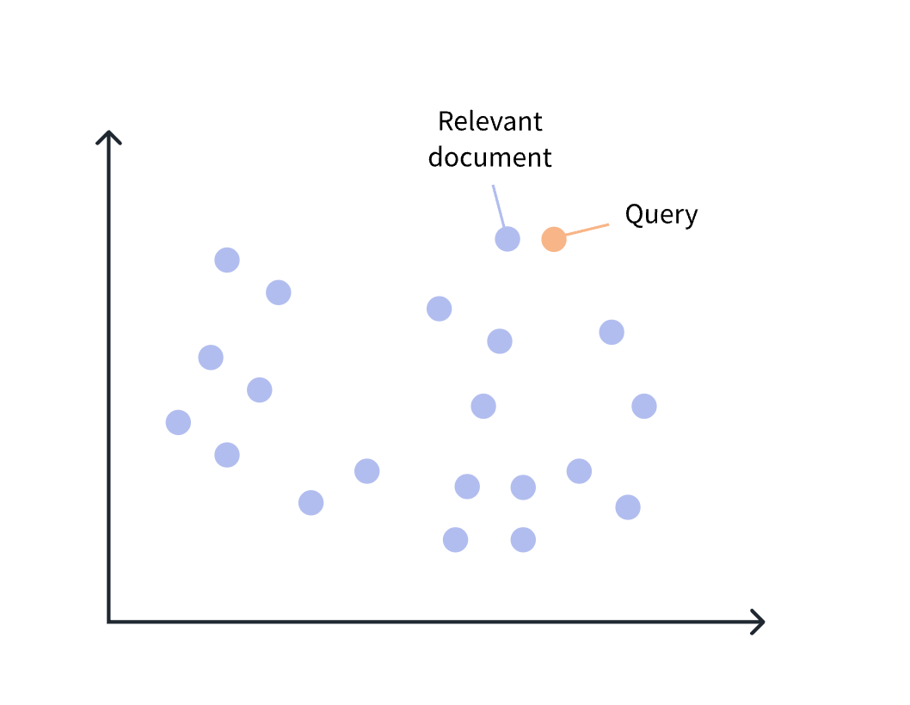
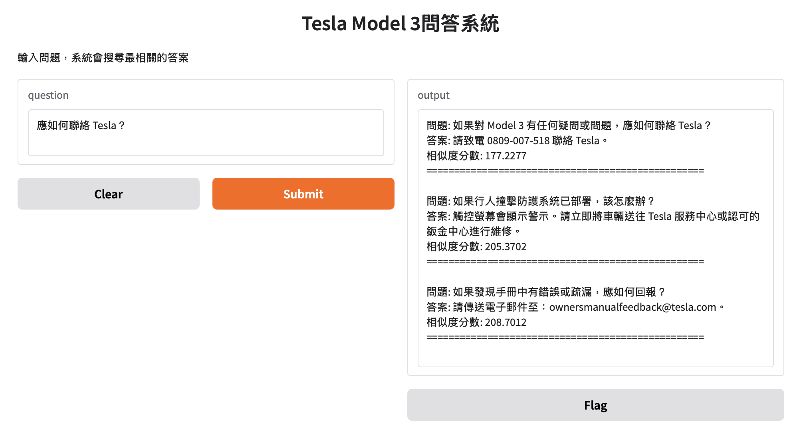

## 檢索增強生成(RAG)

- 使用dataset(roberthsu2003/data_for_RAG) 
- 使用模型(使用Microsoft開源的intfloat/multilingual-e5-large)    
> [!NOTE]
> 資料來源[使用繁體中文評測各家 Embedding 模型的檢索能力](https://ihower.tw/blog/archives/12167)  
- [如何使用檢索的細節說明](./操作說明.ipynb)  
- [測試檢索能力](./測試檢索能力.ipynb)
- [學習對多筆文本搜尋最佳相似度](./學習多筆文本搜尋最佳相似度.ipynb)
- [實作多筆文本中搜尋最佳文本](./實作多筆文本中搜尋最佳文本.ipynb)
- [使用Faiss進行語義搜索-學習](./學習Faiss儲存向量資料.ipynb)
	- Faiss 是 Facebook AI Search 釋出的開源程式庫，不算是資料庫，概念是針對向量建立索引並進行高效率搜索。  
- [Faiss和gradio介面整合(py檔)](./Faiss和gradio介面整合.py)
- [整合至huggingface space](https://huggingface.co/spaces/roberthsu2003/Tasla_modle3_manual)

