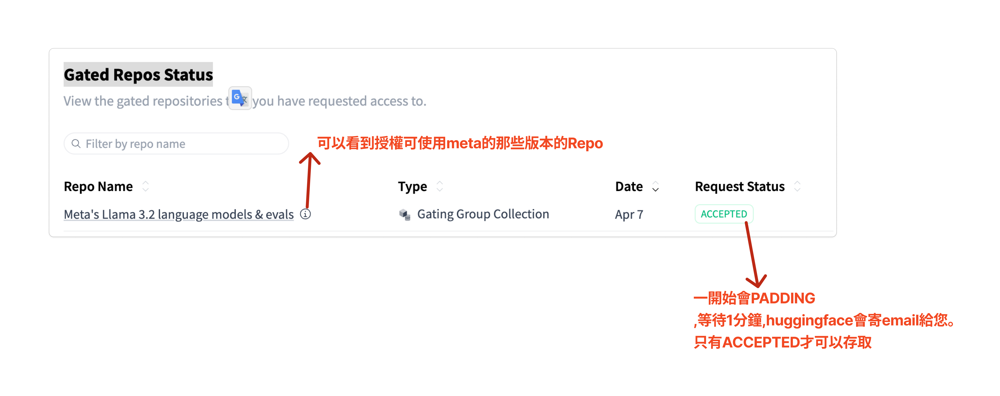
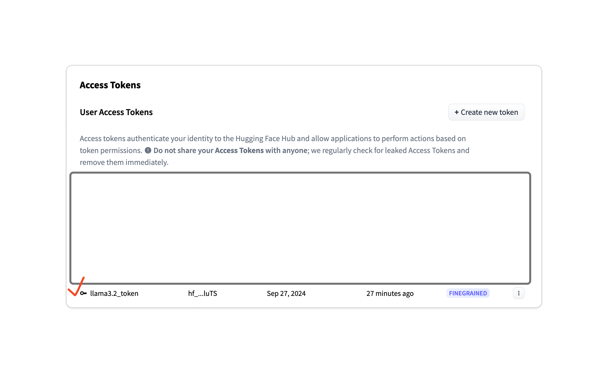

## Meta Llama

- [HuggingFace Meta Llama](https://huggingface.co/meta-llama)

### HuggingFace API

**使用meta-llama/Llama-3.2-3B-Instruct示範**
**使用colab,因為記憶體會超過12GB**

### 模型使用實作
> [!IMPORTENT]
> [實作ipynb](./demo1.ipynb)

#### 使用流程
1. 申請huggingface帳號

2. 進入hugging face的meta-llama/Llama-3.2-3B-Instruct填寫左上角同意書`You need to agree to share your contact information to access this model`,並且按下`同意`

3. 將會看到以下訊息:`Your request to access this repository has been submitted and is awaiting a review from the repository authors. You can check the status of all your access requests in **your settings.**`\   
   請點選your settings,將會進入到個人設定頁面`Gated Repos Status`,如下圖:
   
   
   

4. 設定HuggingFace access token:如下圖

	

5. 使用Colab的secret,保護token

6. 本機端的記憶體不足夠(要12Gb以上),無法執行,colab上必需執行使用T4的GPU,才有足夠的記憶體

7. 程式碼:

