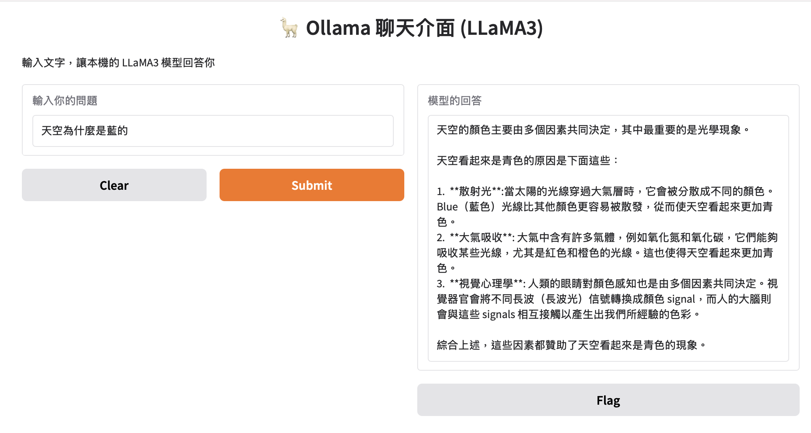

## 使用ollama和openWebUI

1. [安裝Docker](#安裝Docker)
2. [本機安裝Ollama](#本機安裝Ollama)
3. [docker安裝Ollama](#docker安裝Ollama)
4. [docker安裝OpenWebUI](#docker安裝OpenWebUI)
5. [requests連結ollama](#requests連結ollama)
8. [連接gradio的介面呼叫ollama的api](#連接gradio的介面呼叫ollama的api)

<a name="安裝Docker"></a>
### 1. 安裝Docker
- https://docs.docker.com/get-started/get-docker/
---
<a name="本機安裝Ollama"></a>
### 2. 本機安裝Ollama
- 優點:會直接使用Mac的GPU,無GPU自動使用CPU
- [ollama官網](https://ollama.com)
- ollama支援的模型,請參考ollam的官網

**2.1 Ollama基本指令**

**下載模型**

- mac預設下載的目錄`~/.ollama/models/blobs`  
- windows `C:\Users\<用户名>\.ollama\models`  
- linux `~/.ollama/models`  
- 更改預設目錄要修改環境變數`OLLAMA_MODELS` 來指定新的儲存路徑

**更改下載目錄**

- **windows**

```
Windows
	1.	修改系統環境變數：
	•	右鍵點擊「此電腦」，選擇「屬性」。
	•	點擊「高級系統設定」。
	•	在「系統屬性」窗口中，選擇「高級」選項卡，然後點擊「環境變數」。
	•	在「系統變數」部分，點擊「新建」。
	•	輸入「變量名」為 `OLLAMA_MODELS`，並設定「變量值」為您想要的自定義路徑（例如 `D:\Ollama\Models`）。
	•	點擊「確定」保存變更。
	2.	重啟 Ollama：
	•	退出 Ollama 服務（右鍵點擊 Ollama 圖標，選擇「退出」）。
	•	重新啟動 Ollama 服務。
```

- **mac**

```
	1.	設定環境變數：
	•	打開終端機。
	•	如果您使用 Bash，編輯 `~/.bashrc` 文件：
	nano ~/.bashrc
	
	如果您使用 Zsh，編輯 `~/.zshrc` 文件：
	nano ~/.zshrc
	
	在文件末尾添加以下行：
	export OLLAMA_MODELS=~/ollama_download_models
	
	重新載入配置：
	source ~/.bashrc
	source ~/.zshrc
	
	重新開機
  
```

**檢查是否已經安裝Ollama**

```bash
ollama --version
```

**查詢可以下載的模型**

[查詢Ollama支援的Model](https://ollama.com/search)

**下載模型指令**

```bash
ollama pull llama3.2:3b
```

**檢視目前已經下載的模型**

```bash
ollama list
```

**執行模型**

```bash
ollama run llama3.2
```

**停止執行模型**

```
>>> /bye
```


**目前被載入的模型**
- 可以查看是否是使用GPU

```bash
ollama ps

#=====output===
NAME         ID              SIZE      PROCESSOR    UNTIL              
gemma3:4b    a2af6cc3eb7f    6.3 GB    100% GPU     3 minutes from now
```

**停止模型**

```bash
ollama stop llama3.2
```

**刪除模型**

```bash
ollama rm llama3.2
```

---


<a name="docker安裝Ollama"></a>
### 3. docker安裝Ollama
- 缺點:都是使用CPU
- 如果要支援NVIDIA,請安裝NVIDIA Container Toolkit⁠.

```bash
docker run -d -v ollama:/root/.ollama -p 11434:11434 --name ollama ollama/ollama
```


> [!IMPORTANT]
> 安裝完後,可以利用docker desktop內container Exec來執行ollama的指令

---

<a name="docker安裝OpenWebUI"></a>
### 4. docker安裝OpenWebUI

- 可以使用透過網路連線的免費模型(Chatbot Arena有17b的參數量)
- 設定->管理員設定->連線->開啟直接連線(會自動連線Chatbot Arena)

- 由於使用了restart always,docker一被啟動就會自動開啟container(比較秏資源)

```bash
docker run -d --network=host -v open-webui:/app/backend/data -e OLLAMA_BASE_URL=http://127.0.0.1:11434 --name open-webui --restart always ghcr.io/open-webui/open-webui:main
```


- 手動開啟container的語法

```bash
docker run -d --network=host -v open-webui:/app/backend/data -e OLLAMA_BASE_URL=http://127.0.0.1:11434 --name open-webui ghcr.io/open-webui/open-webui:main
```

**使用瀏覽器啟動http://localhost:8080**

---
<a name=“requests連結ollama”></a>

### 5. requests連結ollama

```python
import requests

def chat_with_ollama(prompt: str):
    url = "http://localhost:11434/api/generate"
    payload = {
        "model": "gemma3:1b",
        "prompt": prompt,
        "stream": False,
        "options": { #參考說明1
            "temperature": 0.7,
            "top_p": 0.9,
            "top_k": 50,
        },
        "max_tokens": 100,
        "format": "json",
    }

    response = requests.post(url, json=payload)
    result = response.json()
    print("💬 AI 回應：")
    # Print the whole result for debugging
    print(result)
    # Try to print the 'response' key if it exists, otherwise print possible keys
    if "response" in result:
        print(result["response"])
    elif "message" in result:
        print(result["message"])
    elif "content" in result:
        print(result["content"])
    else:
        print("No expected key found in response. Available keys:", result.keys())

#範例輸入
chat_with_ollama("請用簡單的方式解釋什麼是Python的函式？")
```

<a name="連接gradio的介面呼叫ollama的api"></a>
### 8. 連接gradio的介面呼叫ollama的api



- [ollama api官方說明書](https://github.com/ollama/ollama/blob/main/docs/api.md)

> [!IMPORTANT]
> 1. ollama的服數要開啟
> 2. ollama run 模型名稱
> 3. 本地端或docker api網址不一樣

- [**實作py**](./interface.py)


```python
import requests
import json
import gradio as gr

# 呼叫 Ollama 的函式
def ask_ollama(prompt):
    #url = "http://localhost:11434/api/generate"
    url = "http://host.docker.internal:11434/api/generate"
    headers = {"Content-Type": "application/json"}
    data = {
        "model": "llama3.2:3b",
        "prompt": prompt,
        "stream": False
    }

    try:
        response = requests.post(url, headers=headers, data=json.dumps(data))
        if response.status_code == 200:
            return response.json()['response']
        else:
            return f"⚠️ Error: {response.status_code} - {response.text}"
    except Exception as e:
        return f"❌ Exception: {str(e)}"

# 建立 Gradio 介面
iface = gr.Interface(
    fn=ask_ollama,
    inputs=gr.Textbox(label="輸入你的問題"),
    outputs=gr.Textbox(label="模型的回答"),
    title="🦙 Ollama 聊天介面 (LLaMA3)",
    description="輸入文字，讓本機的 LLaMA3 模型回答你"
)

# 啟動介面
iface.launch()
```
