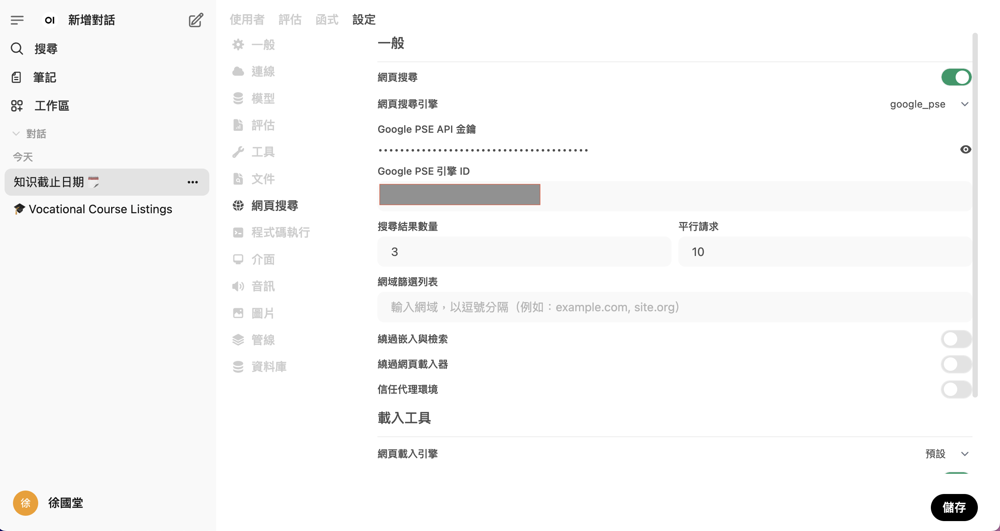

# Open WebUI
## 模組1:基礎認識與安裝

### 1. 什麼是 Open WebUI？
Open WebUI 是一個開源的自托管人工智慧平台，提供類似 ChatGPT 的圖形化使用者介面，讓使用者能夠在本地或雲端環境中，與大型語言模型（LLMs）進行互動。它支援多種模型執行器，如 Ollama 和與 OpenAI API 相容的服務，並設計為可完全離線運行，適合對資料隱私和安全性有高要求的應用場景。

---

## 模組2. Open WebUI 的主要特色與優勢
- 開源、免費、可自訂
-  資料隱私與安全性
-  多模型支援
	-  OpenAI GPT-4/3.5
	-  Ollama 本地模型
	-  OpenRouter（Claude、Gemini、Mixtral）

---

### 3. 安裝 Open WebUI（本地端 & 雲端）
#### 3.1 本地安裝

```bash
docker run -d --network=host \
  -v open-webui:/app/backend/data \
  -e OLLAMA_BASE_URL=http://127.0.0.1:11434 \
  --name open-webui \
  ghcr.io/open-webui/open-webui:main
```

- docker run: 告訴 Docker 執行一個容器
- -d:讓容器在背景執行（detached mode），這樣終端機可以繼續執行其他指令。
- --newwork=host
	- 使用主機網路模式，直接把容器內的網路與主機網路綁定在一起。
	- 用途：如果本機（Host）上有一個 Ollama 模型執行器跑在 http://127.0.0.1:11434（例如 ollama serve），容器裡的 Open WebUI 就能直接存取它（127.0.0.1 代表主機）。
	- 小提醒：在某些系統（例如 Mac 或 Windows 的 Docker Desktop）上--network=host 可能有限制
- -v open-webui:/app/backend/data
	- 建立一個 Docker 卷（volume），名稱是 open-webui。
	- 這樣可以把 /app/backend/data 目錄裡的資料（像是設定檔或使用者資料）持久化到本地磁碟，避免容器刪除後資料遺失。

- -e OLLAMA_BASE_URL=http://127.0.0.1:11434
	-  設定環境變數 OLLAMA_BASE_URL，告訴 Open WebUI 從哪裡呼叫 Ollama 的 API。
	-  預設的 Ollama 埠是 11434，所以這裡就指向本地主機的 Ollama 服務。
- --name open-webui
	- 給容器取個名字（open-webui），方便後續管理（例如：docker stop open-webui）。
- ghcr.io/open-webui/open-webui:main
	- Docker 映像檔的位置（GitHub Container Registry）。
	- :main 表示使用主分支的最新版本。

#### 3.2雲端安裝
3.2.1 選擇雲端平台（GCP、AWS、Azure、Vultr…）  
3.2.2 建立一台 Linux VM（Ubuntu 建議版本 ≥ 20.04）  
3.2.3 安裝 Docker：  

```bash
sudo apt update
sudo apt install docker.io
```

3.2.4 運行 Docker 指令（同本地端）

3.2.5 在防火牆或安全群組設定開放對外埠（3000）


#### 4.初始設定
4.1 帳號註冊與登入(必需記住帳號和密碼)   
---
4.2 模型提供者設定  
- ollama的連線
- 符合openAI API格式的連線  
	- openrouter的連線格式 
	- `https://openrouter.ai/api/v1`


---

4.3 測試模型(可多模型測試)


---

## 模組3:基礎使用與管理

1. **筆記功能（Notes）**

**功能定位**:筆記功能讓你在使用 Open WebUI 與模型互動時，將某段回答（或輸入）「標記起來」並儲存在一個可管理的區塊裡，就像寫下筆記一樣。這對於教學、研究或專案紀錄特別有幫助。

---

2. **「臨時對話」（Temporary Chat）** 

是一項設計用來加強隱私保護與資料合規性的功能。啟用此模式後，使用者的對話內容不會被永久儲存，適合在處理敏感資訊或希望避免留下對話紀錄的情境中使用。

---

3. 工作區 -> 模型
	- 建立自訂名稱的模型,如(寫程式的模型, 翻譯的模型, 寫文章的模型)
---

4. 工作區 -> 知識區
	- 提供相關的文件,讓模型可以依據文件做搜尋的動作
---

5. 工作區 -> 提示詞
	- 建立預先建立好的prompt

---

6. 網頁搜尋(web search)
	- 網頁搜尋選項必需啟動
	- 申請google的Programmable Search Engine
	- 必需要有:Google PSE 引擎 ID
	- 必需要有: Google PSE API 金鑰(金鑰請求必需要按Programmatic access)
	
	

	- 每天10,000請求免費



---

7. 聲音(Audio)

- 以下是預設的畫面


8. openWebUI -> Comminuty(必需有openWebUI網站的帳戶)

---

## 模組4:與模型的互動

1. 支援中文模型:
	- LLama
	- Gemma
	- Mistral
	- codegemma(寫程式專用)

1. 如何連接及呼叫 LLM（如：GPT、LLaMA）

- openrouter:
	- https://openrouter.ai/api/v1
2. 基本 Prompt 工具及使用方式
3. 聊天及問答系統的建立
4. 互動式應用開發（ex. 回答問題、資料摘要、翻譯等）

---

## 模組5:進階應用開發

1. 整合 API（串接外部資源）
2. 使用 Plugins 擴充功能
3. 客製化回應與 Prompt 工程（Prompt Engineering）
4. 多模態應用（如結合圖片、語音等）
5. 
---
## 模組6:專題與實作

1. 設計一個完整的應用案例（如 AI 客服、文件問答系統）
2. 結合實際需求設計 Prompt 流程
3. 簡易部署與展示

---


## **應用方向建議**

- **教育輔助**：建置一個問答系統，供學生自學或課堂互動。
- **知識管理**：建立文件摘要、搜尋、問答功能。
- **客戶服務**：開發簡易客服機器人，協助回答常見問題。
- **資料分析**：結合大語言模型進行資料解讀與分析。
- **語言學習**：搭配多語言模型，支援翻譯、語法解釋等功能。
- **程式教學**：利用 Prompt 讓模型幫忙解釋程式碼、示範範例。

---
