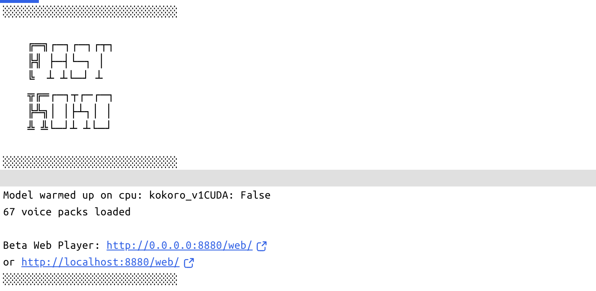
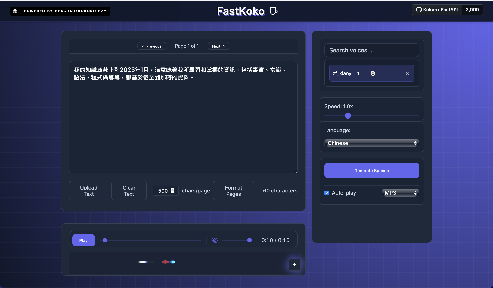

# kokoro TTS 和 fastAPI的整合

## [官方github的說明](./https://github.com/remsky/Kokoro-FastAPI)

- 需要程式碼的整合可以參考上方的官方git hub連結

### 使用官方說明:

**步驟1:Quickest Start (docker run)**

```bash
# the `latest` tag can be used, though it may have some unexpected bonus features which impact stability.
 Named versions should be pinned for your regular usage.
 Feedback/testing is always welcome

docker run -p 8880:8880 ghcr.io/remsky/kokoro-fastapi-cpu:latest # CPU, or:
docker run --gpus all -p 8880:8880 ghcr.io/remsky/kokoro-fastapi-gpu:latest  #NVIDIA GPU
```

---

**步驟2:先使用Web 測試**

- 安裝完成後,檢查container的terminal,將看到以下連結web的畫面,代表安裝成功,並且已經啟動



---

- 連結http://localhost:8880/web/,並且測試語音。




**整合至open WebUI
- TTS Settings
- Text-to-Speeh Engine(選擇OpenAI)
- 網址:`http://host.docker.internal:8880/v1`
- 密碼:`not-needed`
- TTS Voice:(手動修改)
	- zf_xiaoxiao（中文女聲）
	•	zf_xiaobei（中文女聲）
	•	zm_yunxi（中文男聲）
- TTS Model:tts-1-hd


