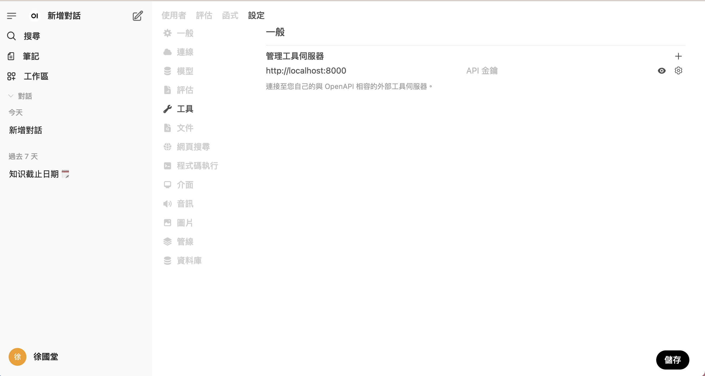
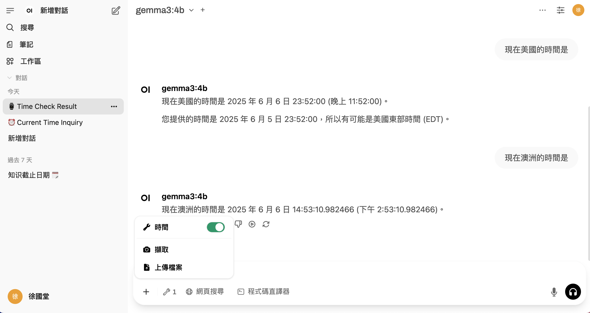
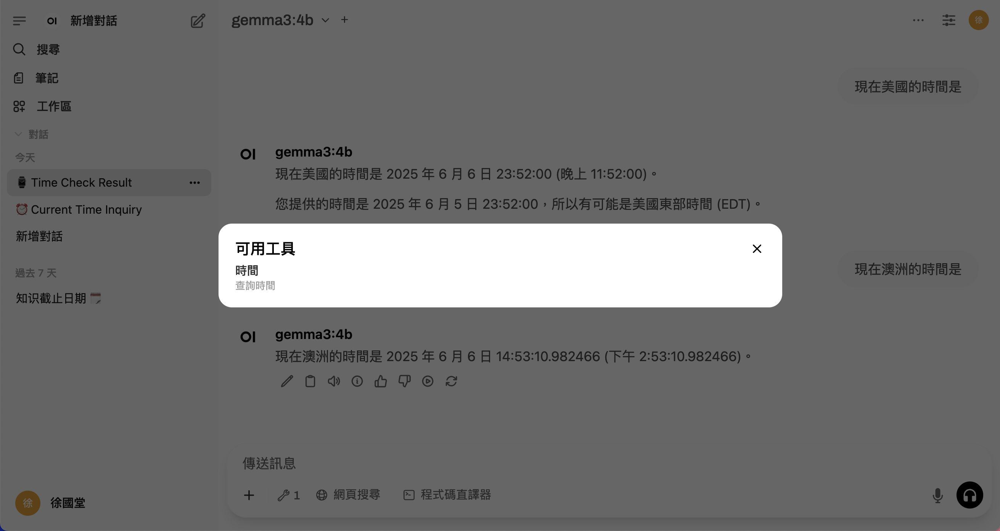

# OpenAPI Tool Servers
## [官方文件](https://docs.openwebui.com/openapi-servers/)

OpenAPI 工具伺服器的參考實現，使開發人員能夠輕鬆安全地將外部工具和資料來源整合到 LLM 代理程式和工作流程中。這些實作旨在最大限度地提高易用性和最小化學習曲線，並採用廣泛採用且久經考驗的 OpenAPI 規範作為標準協定。

透過利用 OpenAPI，我們消除了對專有或不熟悉的通訊協定的需求，確保您可以快速、自信地建置或整合伺服器。這意味著您可以花更少的時間來弄清楚自訂介面，而花更多的時間來建立可增強 AI 應用程式的強大工具。

## 為何使用OpenAPI?
- **既定標準(Established Standard)**:OpenAPI 是一種廣泛使用、經過生產驗證的 API 標準，並獲得數千種工具、公司和社群的支援。

- **無需重新發​​明輪子(No Reinventing the Wheel)**:無需額外文件或專有規格的困擾。如果您現在建置 REST API 或使用 OpenAPI，則已準備就緒。

- **輕鬆整合和託管(Easy Integration & Hosting)**:在外部或本機部署您的工具伺服器，無需供應商鎖定或複雜的配置。

- **高度重視安全(Strong Security Focus)**:OpenAPI 圍繞著 HTTP/REST API 構建，本質上支援廣泛使用的安全通訊方法，包括 HTTPS 和成熟的身份驗證標準（OAuth、JWT、API 金鑰）。

- **面向未來且穩定(Future-Friendly & Stable**:與不太成熟或實驗性的協議不同，OpenAPI 承諾可靠性、穩定性和長期的社群支持。

## 快速開始:
使用 servers/ 目錄中提供的基於 FastAPI 的參考實作快速入門。（您可以根據需要將這些範例整合到您喜歡的工具中，例如使用 FastAPI、FastOpenAPI 或任何其他相容 OpenAPI 的程式庫）：

```bash
git clone https://github.com/open-webui/openapi-servers
cd openapi-servers

# Example: Installing dependencies for a specific server 'filesystem'
cd servers/filesystem
pip install -r requirements.txt
uvicorn main:app --host 0.0.0.0 --reload
```

## Open WebUI的[討論社群](https://github.com/open-webui/openapi-servers/discussions)

## Open WebUI 整合
Open WebUI v0.6+ 支援透過 OpenAPI 伺服器與外部工具無縫整合 - 這意味著您可以使用自訂或社群支援的工具伺服器輕鬆擴展您的 LLM 工作流程

在本指南中，您將學習如何啟動與 OpenAI 相容的工具伺服器，並透過直覺的使用者介面將其連接到 Open Web UI。現在就開始吧！

### 步驟1:啟動一個OpenAPI的Tool Server
首先，您需要啟動 openapi-servers 倉庫中提供的參考工具伺服器之一。為了快速測試，我們將使用 time 工具伺服器作為範例。

➜Example: Starting the time server locally

```bash
git clone https://github.com/open-webui/openapi-servers
cd openapi-servers

# Navigate to the time server
cd servers/time

# Install required dependencies
pip install -r requirements.txt

# Start the server
uvicorn main:app --host 0.0.0.0 --reload
```

### Step 2:從Open WebUI連線至Connect Tool Server

1. 在瀏覽器中開啟 WebUI。
2. 打開 ⚙️ 設定。
3. 點選 ➕ 工具 新增的工具伺服器。
4. 輸入您的 OpenAPI 工具伺服器執行的 URL（例如，http://localhost:8000）。
5. 點選“儲存”。



### Step 3: 確認Tool Server已經連線

1. 關閉open webUI 瀏灠器,重新啟動

2. 啟動工具



3. 對話框可以看到小工具




